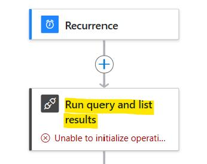
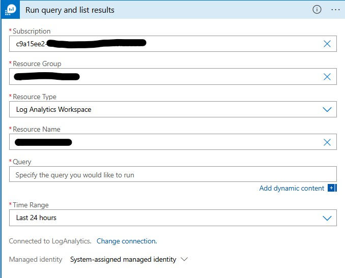
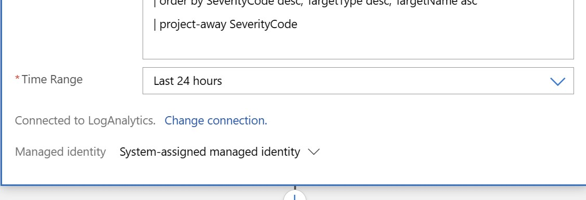

<h3>Azure SQL BPA OpenAI integration: Configuration</h3>
 
| **Parameters** | **Information** | **Note** |
| ------------- | ------------- | ------------- |
| replacewithsubid | Connection setting during deployment | Replace with your Subscription ID |
| replacewithRG | Connection setting during deployment | Replace with the selected RG Name for the deployment |
| replace with tenant id | HTTP Module: Tenant ID | Replace with your Tenant ID |

 
 
<h3> Deployment and Result </h3>
 
After deployment completed, please follow the documentation:

Change the broken module Run query and list result with a new one.
 
Before:  

After:  

The first "Get blob content (V2)" block must be configured with the final name of the blob (read file) that will store the Delta URL Link (in yellow). Please Use the same Blob Name for all the Blob Blocs:
 

 
The Flow have different HTTP blocks required for get informations from Azure Graph. Please exand all the foreach blocks and customize the HTTP blocks as shown below. Keep in mind that the chosen solution must have permission to read Azure Graph. Ensure to have a Service Principal with all the required permission <a href=https://learn.microsoft.com/en-us/graph/api/user-get?>reported here</a>  and <a href=https://learn.microsoft.com/en-us/azure/purview/create-service-principal-azure>here</a>. For a tutorial please refer to <a href=https://techcommunity.microsoft.com/t5/azure-integration-services-blog/calling-graph-api-from-azure-logic-apps-using-delegated/ba-p/1997666>this link</a>:
 

 
Remember to change the group name inside the foreach block in order to check only modification to the required group:
 

 
The last step is to add and customise the Send e-mail form (V2) to send an e-mail with the requested information. You can customise it as you wish. The block must be placed at the end of the logic app flow.
 
