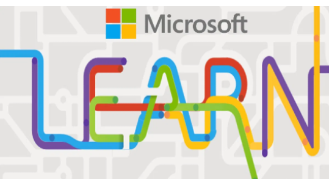
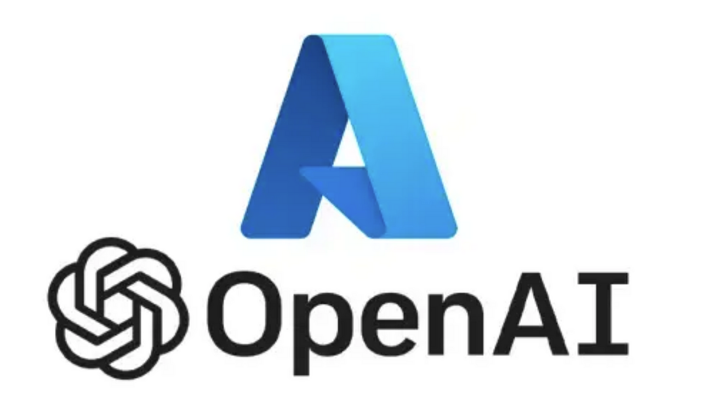
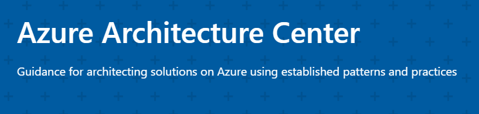

# Learning Repository

This folder contains information and learning resources for various Azure and OpenAI technologies. The goal is to provide a comprehensive understanding of these tools, their applications, and how to use them effectively.

---

## Contents

### 1. OpenAI on Azure
- **Overview**: OpenAI on Azure enables developers to integrate advanced AI models like GPT and Codex into their applications. These models can help with text generation, summarization, code completion, and more.
- **Use Cases**:
  - **Customer Support**: Implement AI-powered chatbots to handle common customer queries.
  - **Content Generation**: Automate the creation of articles, social media posts, and reports.
  - **Coding Assistance**: Enhance developer productivity by integrating AI-based coding tools.
- **Key Features**:
  - Access to pre-trained OpenAI models such as GPT-4.
  - Fine-tuning capabilities for custom model training.
  - Built-in Azure security and compliance.
- **Resources**:
  - [Azure OpenAI Documentation](https://learn.microsoft.com/en-us/azure/ai-services/openai/)
  - [Getting Started with Azure OpenAI](https://learn.microsoft.com/en-us/azure/ai-services/openai/chatgpt-quickstart?tabs=command-line%2Cjavascript-keyless%2Ctypescript-keyless%2Cpython-new&pivots=programming-language-python)

### 2. Azure Logic Apps
- **Overview**: Azure Logic Apps simplifies the creation of automated workflows by connecting various services and applications. It is a low-code/no-code solution suitable for developers and non-developers alike.
- **Use Cases**:
  - **Automated Data Processing**: Integrate cloud services to process and store data.
  - **Alerting Systems**: Build workflows that trigger alerts based on specific conditions.
  - **Integration**: Connect on-premises systems with cloud-based applications.
- **Key Features**:
  - Hundreds of pre-built connectors for services like Microsoft 365, SQL Server, and Salesforce.
  - Built-in monitoring and diagnostics tools.
  - Support for complex workflows with conditional logic.
- **Resources**:
  - [Azure Logic Apps Overview](https://learn.microsoft.com/en-us/azure/logic-apps/)
  - [Tutorial for Azure Logic Apps](https://learn.microsoft.com/en-us/azure/logic-apps/tutorial-build-schedule-recurring-logic-app-workflow)

### 3. Azure API Management (APIM)
- **Overview**: Azure API Management provides a comprehensive solution for managing, securing, and monitoring APIs. It is designed to help organizations expose their services securely while ensuring scalability and high performance.
- **Use Cases**:
  - **API Gateways**: Centralize API traffic with built-in caching and load balancing.
  - **Security**: Protect APIs with authentication, authorization, and rate-limiting features.
  - **Developer Portals**: Provide documentation and tools for developers to interact with your APIs.
- **Key Features**:
  - Full lifecycle API management: design, deploy, and retire APIs.
  - Built-in support for OpenAPI Specification.
  - Analytics and insights into API usage.
- **Resources**:
  - [Introduction to Azure API Management](https://learn.microsoft.com/en-us/azure/api-management/)
  - [How to Create APIs with Azure APIM](https://learn.microsoft.com/en-us/azure/api-management/import-and-publish)

### 4. Artificial Intelligence (AI) and Machine Learning (ML) on Azure
- **Overview**: Azure provides robust tools and frameworks for incorporating artificial intelligence (AI) and machine learning (ML) into business solutions. It supports a wide range of AI use cases, from large-scale language models to advanced deep learning frameworks.
- **Use Cases**:
  - **Generative AI**: Develop applications that create new content such as text, images, or code.
  - **Predictive Analytics**: Use ML models to forecast trends and improve decision-making.
  - **Intelligent Automation**: Integrate AI into workflows to enhance efficiency and reduce manual effort.
- **Key Features**:
  - Support for popular ML frameworks like TensorFlow and PyTorch.
  - Comprehensive AI services, including Azure Cognitive Services and Azure Machine Learning.
  - Seamless integration with other Azure tools for deployment and monitoring.
- **Resources**:
  - [AI and Machine Learning Architecture Overview](https://learn.microsoft.com/en-us/azure/architecture/ai-ml/)

### 5. Get started with Azure OpenAI Service (MS Learning) and Design Architectures
- **Overview**: This module provides engineers with the skills to begin building an Azure OpenAI Service solution.
- **Learning objectives**: By the end of this module, you'll be able to:
    - Create an Azure OpenAI Service resource and understand types of Azure OpenAI base models.
    - Use the Azure AI Studio, console, or REST API to deploy a base model and test it in the Studio's playgrounds.
    - Generate completions to prompts and begin to manage model parameters.
- **Resources**:
  - [Azure OpenAI Service Modules](https://learn.microsoft.com/en-us/training/modules/get-started-openai/)
  - [Module assessment](https://learn.microsoft.com/training/modules/get-started-openai/9-knowledge-check/)
