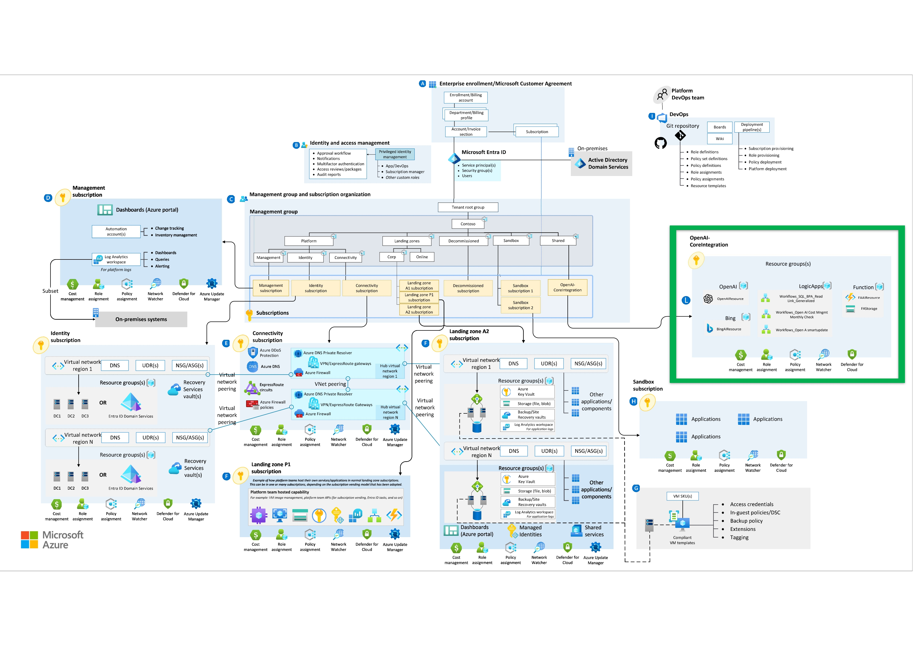
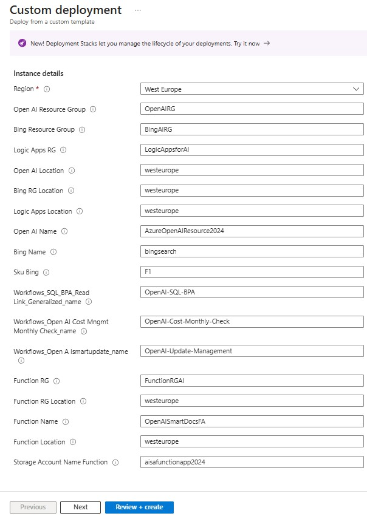
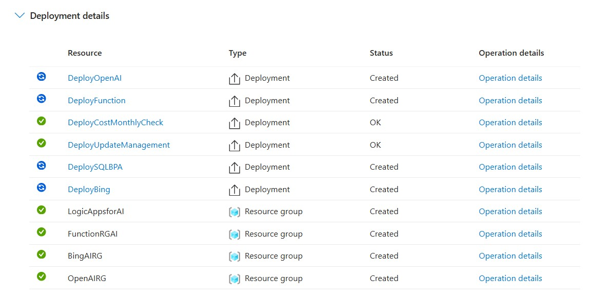
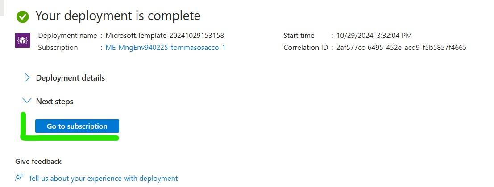

<h3>OpenAI-CoreIntegrationLZ</h3>
 
| **Parameters/Requirements** | **Information** | **Note** |
| ------------- | ------------- | ------------- |
| Region | The Default Region used for the deployment | Select the Region  |
| Open AI Resource Group | Create the Resource Group for OpenAI resource | Replace with RG Name |
| Bing Resource Group | Create the Resource Group for Bing resource | Replace with RG Name |
| Logic Apps Resource Group | Create the Resource Group for Logic Apps resource | Replace with RG Name |
| Open AI Location | Insert the Location for the deployment of Azure OpenAI | Replace with the location |
| Bing RG Location | Insert the Location for the Resource Group Deployment related Bing | Replace with the location |
| Logic Apps Location | Insert the Location for the Logic Apps Deployment | Replace with the location |
| Open AI Name | Insert the name for the Open AI Deployed resource | Replace with the name |
| Bing Name | Insert the name for the Bing Deployed resource | Replace with the name |
| Sku Bing | Insert the required sku for the Bing Deployed resource | Replace with the chosed sku |
| Workflows_SQL_BPA_Read Link_Generalized_name | Insert the name for the SQL BPA Logic App Deployed | Replace with the required name |
| Workflows_Open AI Cost Mngmt Monthly Check_name | Insert the name for the Cost Mgmt Logic App Deployed | Replace with the required name |
| Workflows_Open AI Cost Mngmt Monthly Check_name | Insert the name for the Cost Mgmt Logic App Deployed | Replace with the required name |
| Function RG | Insert the name for the Function App Resource Group | Replace with the required name |
| Function RG Location | Insert the location for the RG where the Function will be placed | Replace with the location |
| Function Name | Insert the name Function App Deployed | Replace with the required name |
| Function Location | Insert the location for the Function App Deployed | Replace with the location |
| Storage Account Name Function | Insert the name for the Storage Account | The Storage Account is a mandatory resource for the Function App |

<h3> Important </h3>
 The following deployment require a dedicated Subscription already in-place. This subscription, following the Enterprise Scale Diagram, must be placed in a identified Management Group

 Reference:
 [Azure Enterprise Scale Reference](https://learn.microsoft.com/en-us/azure/cloud-adoption-framework/ready/landing-zone/#azure-landing-zone-architecture)

 <h3> Architectural Overview <h3>

 

<h2>Deploy</h2>

<a href="https://github.com/DevOpsStyle/OpenAI-CoreIntegration/blob/V0.2/OpenAI-CoreIntegrationLZ/README.md#openai-coreintegrationlz" target="_blank">Configuration</a>

When you deploy, replace all the parameters with the required information

If the information provided are correct, the deployment will proceed

<h2>Post Deployment</h2>

When the deployment is completed, to view all the resources go to Azure Portal > Subscription > Select the subscription used during the deployment > Resources

or click on the "Go to subscription" button:

<h2>Solution Configuration<h2>

Each solution created in the initiative have a dedicated configuration flow:

- [SQL BPA Enhanced Assessment Logic App](../Arc-SQL%20BPA/README.md)
- [Cost Monthly Check Logic App](../CostMonthlyCheck/README.md)
- [Upcate Management Logic App](../UpdateManagement/README.md)
- Function App: An empty box ready to be used for deploy custom Script\Application integrated with OpenAI. (Some example will be provided during the engagement. An App Developer skilled on Azure Function Customization and Deployment is needed).

Please reach your CSA for be followed during the configuration.
