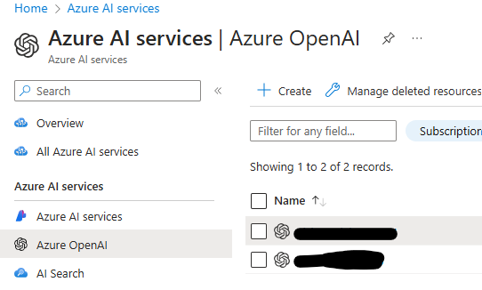

Welcome to the **Microsoft Azure AI for Operation Framework** repo! The purpose of this site is to provide sample OpenAI integration with LogicApp

 **Solution Name** | **Information** | **Configuration** |
| ------------- | ------------- | ------------- |
| Arc-SQL BPA | Logic App used to Asses with Azure OpenAI your DBs on Azure ARC Solution | [Configuration Link](./Arc-SQL%20BPA/README.md) |
| UpdateManager Integration | Logic App used to Integrate Azure UM with OpenAI comment | [Configuration Link](./UpdateManagement/README.md) |
| CostMonthlyCheck Integration | Logic App used to Monitor Cost Monthly with OpenAI comment | [Configuration Link](./CostMonthlyCheck/README.md) |
| Anomalies Detection Integration | Logic App used to Monitor Anomalies Detection | [Configuration Link](./AnomaliesDetection/README.md) |
| AI for Operation Framework LZ | Foundation - ARM template for AI for Op Landing Zone | [Configuration Link](./OpenAI-CoreIntegrationLZ/README.md) |
| Sentinel Integration | Logic App used to Integrate Azure OpenAI with your Sentinel SIEM System | [Configuration Link](./Sentinel/README.md) |

<h2>Learning Resources</h2>

</img>
Explore detailed resources and guides on key Azure technologies and OpenAI Landing Zone Architectural Reference in the [Learning Folder](./Learning/README.md). This folder includes insights on:
- OpenAI integration with Azure
- Building workflows with Logic Apps
- Managing APIs with Azure API Management
- Using AI and Machine Learning on Azure
- Other essential Azure technologies

<h2>Prerequisites</h2>
 

 Enable Azure OpenAI service and configure LLM model. Please be aware that some solutions may require some specific Azure OpenAI model.

<h2>Arc-SQL BestPracticesAssessment OpenAI integration</h2>

 
This template can be used for the deployment of a Logic App of SQL BPA with OpenAI report.
 

<h2>Azure UpdateManager OpenAI integration</h2>

This template can be used for the deployment of a Logic App to send UpdateManager report with OpenAI Comment of Pending security fix.

<h2>Azure Cost Monthly Check OpenAI integration</h2>

This template can be used for the deployment of a Logic App to send Monthly Cost Monitor report with OpenAI Comment.

<h2>Azure Anomalies Detection</h2>

This template can be used for the deployment of a Logic App to monitor anomalies on AD and other scenario.

<h2>Sentinel OpenAI integration</h2>

This template can be used for the deployment of a Logic App in order to be triggered by Sentinel during the creation of an incident.

## Contributing

Microsoft VBD Azure AI for Operation Framework is designed to offer customers customizable solutions that leverage the power of Microsoft's Logic Apps and the advanced AI capabilities of OpenAI. This versatile Business Development Framework enables seamless integration with a variety of Microsoft services, including Azure ARC and Sentinel, enhancing security, scalability, and operational efficiency. Through this platform, users can create robust, intelligent applications capable of dynamically responding to evolving business and security needs.

This project has adopted the [Microsoft Open Source Code of Conduct](https://opensource.microsoft.com/codeofconduct/).
For more information see the [Code of Conduct FAQ](https://opensource.microsoft.com/codeofconduct/faq/) or
contact:
- [siverza@microsoft.com](mailto:siverza@microsoft.com) | [LinkedIn](https://www.linkedin.com/in/simone-verza/)
- [tommasosacco@microsoft.com](mailto:tommasosacco@microsoft.com) | [LinkedIn](https://www.linkedin.com/in/tommasosaccoit/) 
- [saverio.lorenzini@microsoft.com](mailto:saverio.lorenzini@microsoft.com) | [LinkedIn](https://www.linkedin.com/in/saveriolorenzini/)
- [adegregorio@microsoft.com](mailto:adegregorio@microsoft.com) | [LinkedIn](https://www.linkedin.com/in/andreadegregorioit/)
- [gianluca.derossi@microsoft.com](mailto:gianluca.derossi@microsoft.com) | [LinkedIn](https://www.linkedin.com/in/gderossi/)

## Trademarks

This project may contain trademarks or logos for projects, products, or services. Authorized use of Microsoft
trademarks or logos is subject to and must follow
[Microsoft's Trademark & Brand Guidelines](https://www.microsoft.com/en-us/legal/intellectualproperty/trademarks/usage/general).
Use of Microsoft trademarks or logos in modified versions of this project must not cause confusion or imply Microsoft sponsorship.
Any use of third-party trademarks or logos are subject to those third-party's policies.