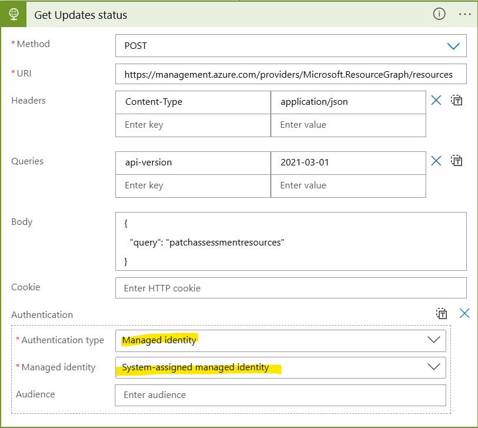
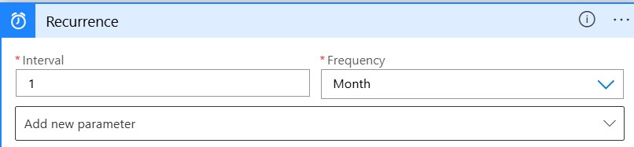
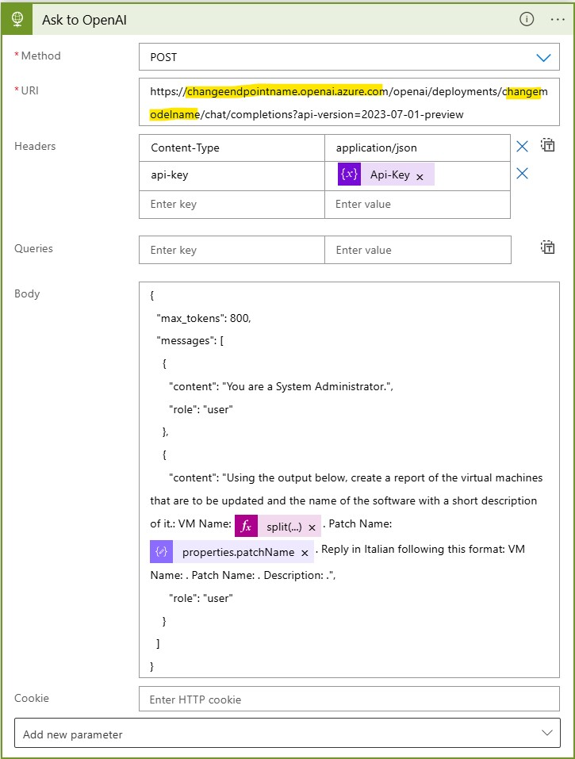
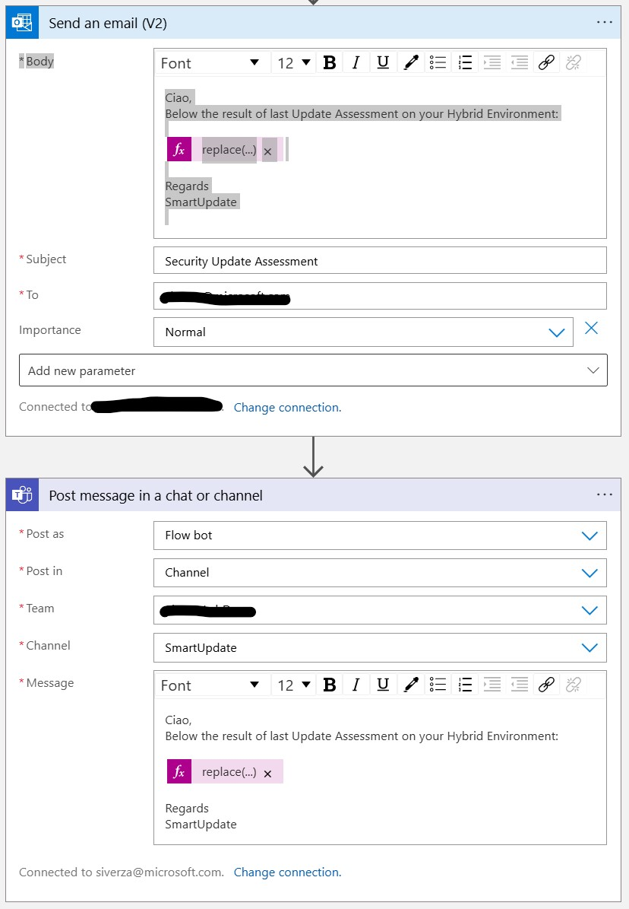

<h3>Azure UpdateManager OpenAI integration: Configuration</h3>
 
| **Parameters** | **Information** | **Note** |
| ------------- | ------------- | ------------- |
| **Parameters** | **Information** | **Note** |
| ------------- | ------------- | ------------- |
| replacewithsubid | Connection setting during deployment | Replace with your Subscription ID |
| repreplacewithRG | Connection setting during deployment | Replace with the selected RG Name for the deployment |
| api-key | The API code for manage your OpenAI service | The parameter is inside the second "Initialize Variable". Put your question in the "value" attribute  |
| changeendpointname | Insert the OpenAI endpoint name | You can found the value inside the OpenAI resource inside Azure Cognitive Service |
| changemodelname | Insert the model name | You can found the value inside the OpenAI resource inside Azure Cognitive Service |

<h3> Important </h3>
 This LogApp and the following changes are an example of integrating UpdateManager results with OpenAI, creating a report send via Email with OpenAI comment of pending Security Update of your environment. 
 
 
<h3>Required Identity</h3>
<h4>Managed Identity</h4>

Now configure the HTTP request to the Graph Explorer enabling the authentication via System Assigned Managed Identity. Please remind that the Managed Identity need to have the righ permission on the subscription for read the resources:

<h3> Deployment and Result </h3>
 
After deployment completed, please follow the documentation:

As first step please configure the required recurrence:

Configure the Api Key with the value inside your OpenAI Service:

At this point we need to configure the Ask to OpenAI module replacing the required parameters:

In the example below we have a "Send Email V2" connector for send the final report to the required people or to a Teams channel . If you want to follow the same approach configure the module following the same example adding them at the end of the Logic App. Make sure to use the correct variable in the body of the email in order to have them correctly formatted:

